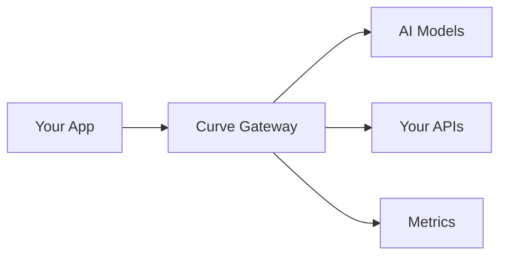

<div align="center">
  
  [](https://curvegateway.com)
  [](https://discord.gg/coming-soon)
  [](https://twitter.com/curvegateway)
  
  <h1>Transform Your AI Apps</h1>
  <p>Turn simple APIs into powerful AI agents. Curve sits between your apps and AI services, making everything work together seamlessly.</p>
</div>

<p align="center">
  <a href="#why-curve">Why Curve?</a> •
  <a href="#core-features">Features</a> •
  <a href="#quick-tour">Demos</a> •
  <a href="#get-started-in-5-minutes">Quick Start</a> •
  <a href="#advanced-usage">Advanced</a>
</p>

## ✨ Why Curve?

- **Zero Friction**: Drop it in and watch your apps talk to AI services naturally
- **Smart Routing**: Your requests always reach the right AI model
- **Rock-Solid**: Built to handle millions of requests without breaking a sweat
- **See Everything**: Know exactly how your AI services perform
- **Stay Protected**: Built-in shields against misuse and attacks

## 🚀 Core Features

Built on proven foundations:
- 🔄 Intelligent request routing and load balancing
- ⚡️ Real-time function calling and API integration
- 🛡️ Advanced prompt security and filtering
- 🔁 Multi-model support with automatic failover
- 📊 Complete observability with W3C tracing

## 🎯 Quick Tour

Check out what's possible:
- 🌤️ [Weather Bot](demo/weather_forecast/README.md) - Live weather data integration
- 🏥 [Insurance Helper](demo/insurance_agent/README.md) - Policy management and claims
- 🔧 [Network Assistant](demo/network_agent/README.md) - Network monitoring and control
- 💱 [Currency Exchange](demo/currency_exchange/README.md) - Real-time forex rates
- 🤖 [LLM Router](demo/llm_routing/README.md) - Multi-model management

## Get Started in 5 Minutes

1. Grab the tools:
   ```bash
   # You'll need these
   docker compose version 2.29+
   python 3.12+
   ```

2. Install Curve:
   ```bash
   python -m venv venv
   source venv/bin/activate
   pip install server/ #make sure you're in the curve directory
   ```

3. Create your first agent:
   ```yaml
   # config.yaml
   version: v0.1
   listener:
     address: 0.0.0.0
     port: 10000
     message_format: huggingface
     connect_timeout: 0.005s
   
   llm_providers:
     - name: gpt-4
       provider: openai
       access_key: $OPENAI_API_KEY
   
   prompt_guards:
     input_guards:
       jailbreak:
         on_exception:
           message: Request blocked for security
   ```

4. Launch:
   ```bash
   curvegw up config.yaml
   ```

5. Start chatting:
   ```bash
   curl localhost:10000/v1/chat/completions \
     -H 'Content-Type: application/json' \
     -d '{"messages":[{"role":"user","content":"Hello!"}]}'
   ```

## 🛠️ Advanced Usage

### 🔄 LLM Routing
Switch between models on the fly:
```bash
curl -H 'x-curve-llm-provider-hint: gpt-4' localhost:10000/v1/chat/completions
```

### ⚡️ Function Calling
Connect to your APIs:
```yaml
prompt_targets:
  - name: get_weather
    endpoint:
      name: weather_api
      path: /v1/current
```

### 🛡️ Security Features
Built-in protection against:
- 🚫 Prompt injection
- 🔒 Jailbreak attempts
- 🔑 Token theft
- ⚡️ Rate abuse

## 📊 Watch It Work

Monitor everything in real-time:


- 📈 Performance metrics: http://localhost:19901/stats
- 🎯 Visual dashboards: http://localhost:3000/
- 🔍 Request tracing: http://localhost:16686/

## 🌟 Community & Support

<div align="center">
  
  [](https://github.com/curvelaboratory/curve)
  [](https://twitter.com/curvegateway)
  
</div>

- 🐦 [Twitter Updates](https://twitter.com/curvegateway)
- 📧 [Email Support](mailto:support@curvegateway.com)

---

<div align="center">
  <sub>Built with ❤️ by the Curve team</sub>
</div>
